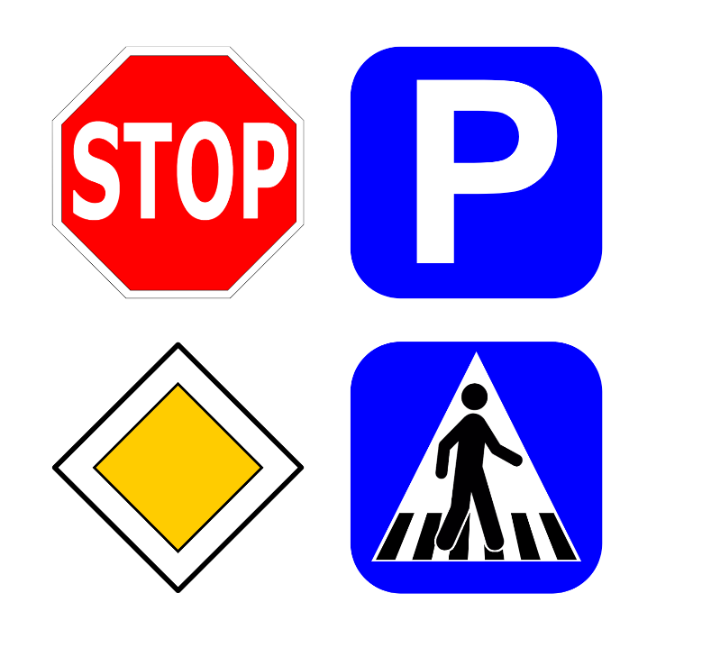
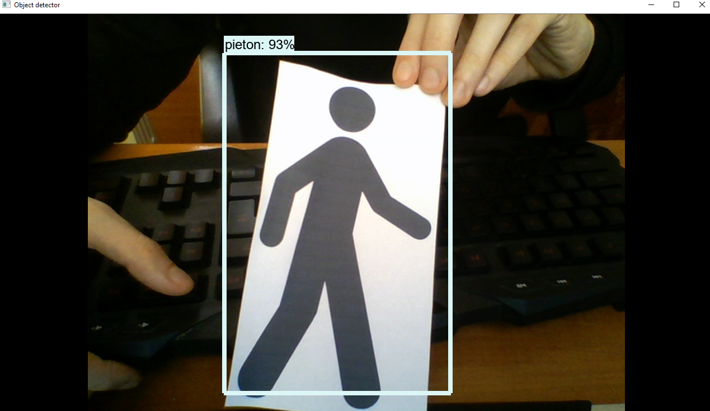
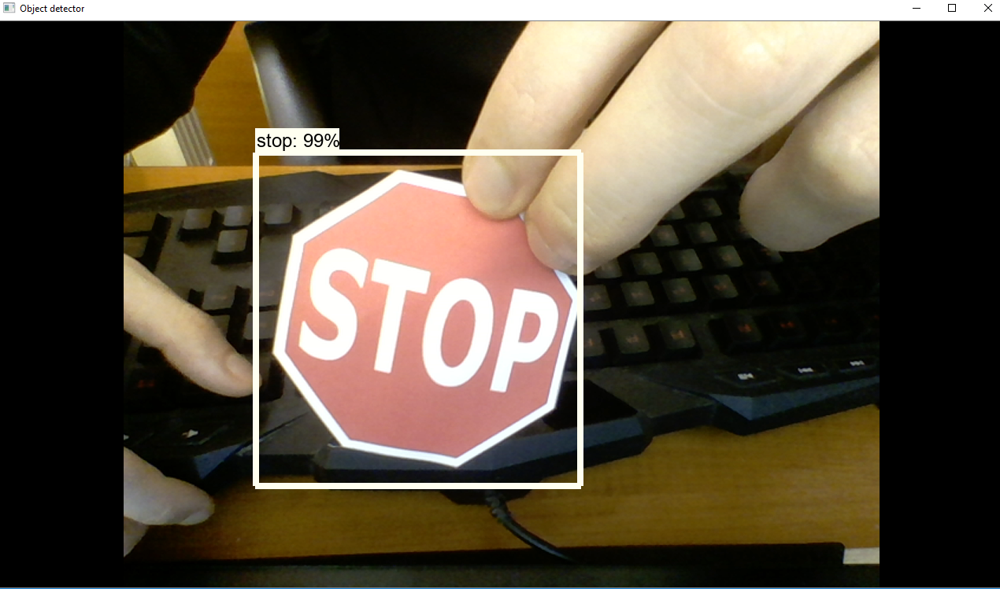
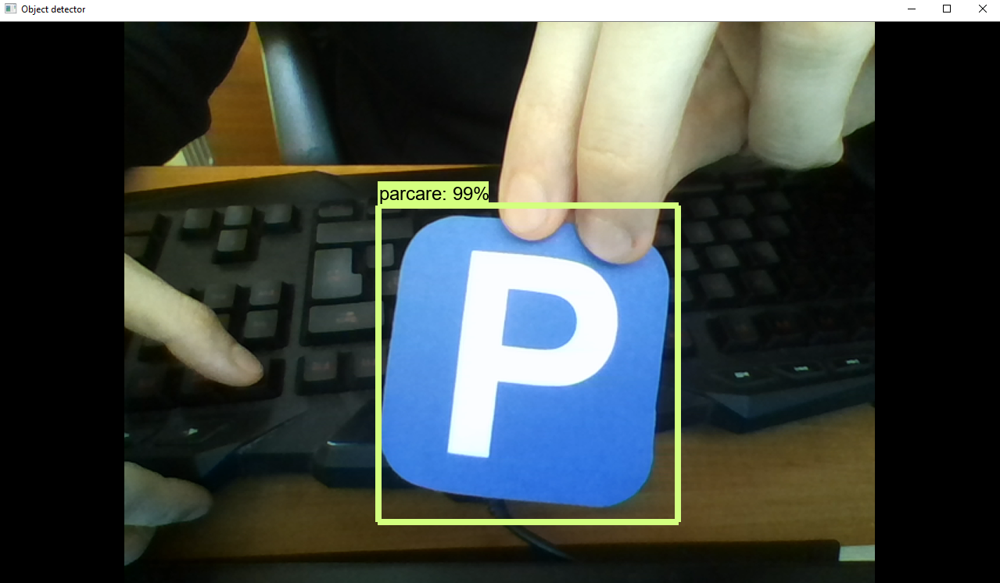
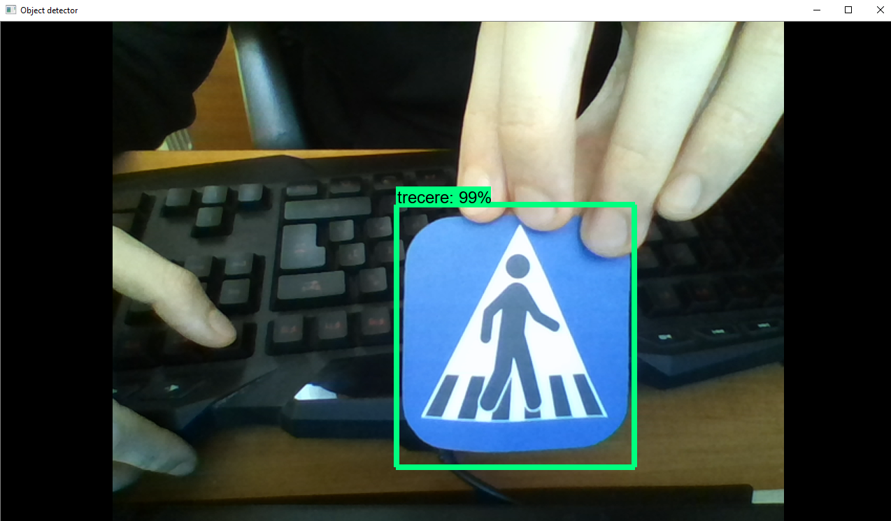
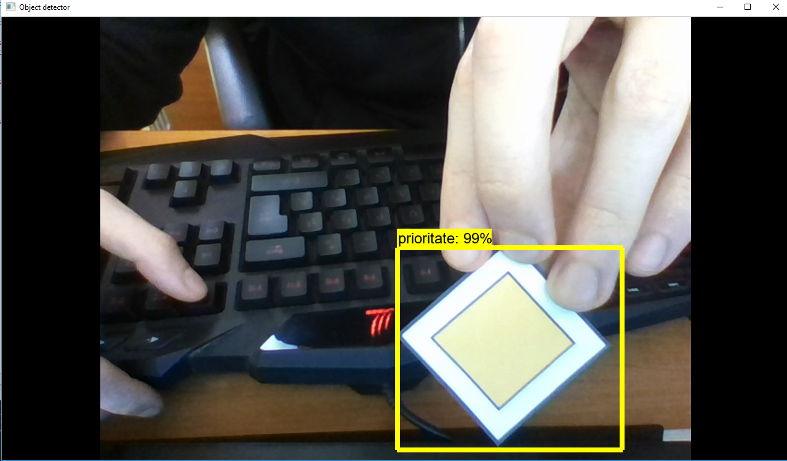

## Traffic-signs-detection

For this project I have worked with anaconda command terminal

!!!!(You will have to install the CUDA toolkit and cuDNN from nVidia in order to run the code. I have used the version 8)!!!

And this will only work if you have a nVidia GPU

First, you will have to set up a new anaconda virtual environment
```
C:\> conda create -n tensorflow1 pip python=3.5
```
Then, activate the environment and update pip by issuing:
```
C:\> activate tensorflow1
```
```
(tensorflow1) C:\>python -m pip install --upgrade pip
```
Install tensorflow-gpu in this environment by issuing:
```
(tensorflow1) C:\> pip install --ignore-installed --upgrade tensorflow-gpu
```

Install the other necessary packages by issuing the following commands:
```
(tensorflow1) C:\> conda install -c anaconda protobuf
(tensorflow1) C:\> pip install pillow
(tensorflow1) C:\> pip install lxml
(tensorflow1) C:\> pip install Cython
(tensorflow1) C:\> pip install contextlib2
(tensorflow1) C:\> pip install jupyter
(tensorflow1) C:\> pip install matplotlib
(tensorflow1) C:\> pip install pandas
(tensorflow1) C:\> pip install opencv-python
```
Then cd to the "traffic signs model" folder 

Enter the "idle" command in the terminal

Open the Object_detection_webcam script and run it

This script uses your webcam to detect 4 traffic signs and a pedestrian model




After running the code the results should look like this











This was my part in the BFMC2020 contest where me and my team had to develope an autonomous driving car algorithm using raspberry pi and nucleo boards. 

The car can cross intersections, stop when it detects a pedestrian and park when detects the parking sign

[Here](
https://drive.google.com/drive/folders/1uKzgPz9mh71zM23fmOII8WQsiaBDKj3A?fbclid=IwAR1967_PEPygsGkiqJ_lAJiKUsXAre5Eqc0-rM6oLF1wmpXxxIhQKUMxhCo) you can see the car performing a few tasks on the track

